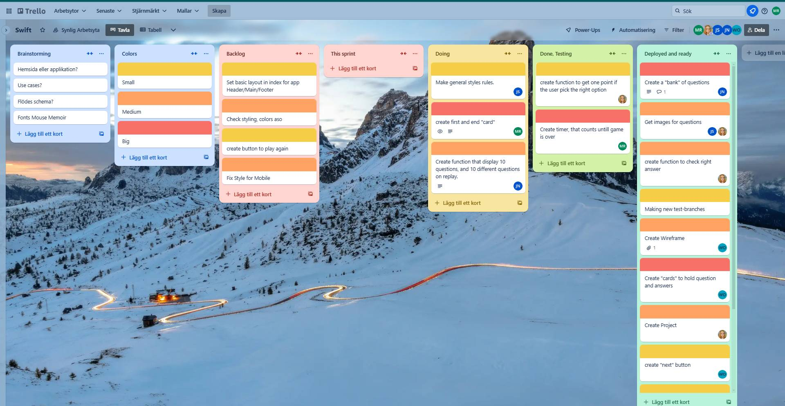
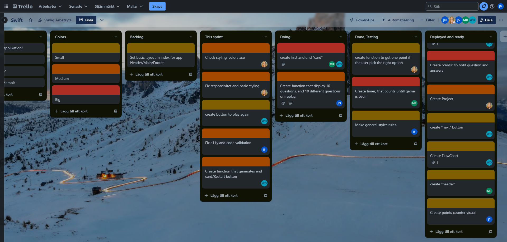
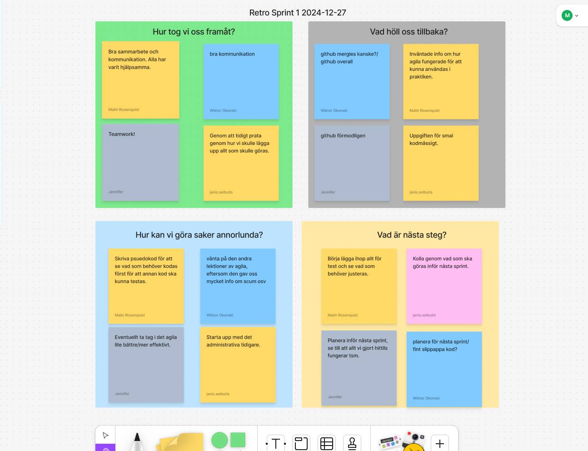

# Trello Log - Team Swift

_Trello board on December 13, 2024._ 

_Trello board on December 17, 2024._ 

_Trello board on December 19, 2024._ 

_Trello board on December 23, 2024._ 

_Trello board on December 30, 2024._ 

# Retro Log - Team Swift

_Retro board on December 27, 2024._ 

## Tech stack
**Client:**   

## Authors

- [@Wiktor Okonski](https://github.com/PotoVic)

- [@Janis Seibutis](https://github.com/JanisSeibutis)

- [@Malin Rosenquist](https://github.com/MalinRosenquist)

- [@Emelie Wiberg](https://github.com/Erm0es)

- [@Jennifer Nilsson](https://github.com/ynnxj)